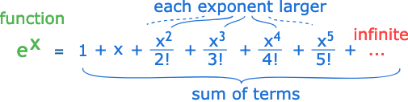
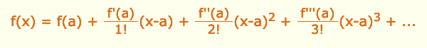

# Taylor Series
[docs](https://www.mathsisfun.com/algebra/taylor-series.html)

This is a way to create a function with an infinite number of terms where each term's exponent is larger and larger to then equal another `analytic` function.

